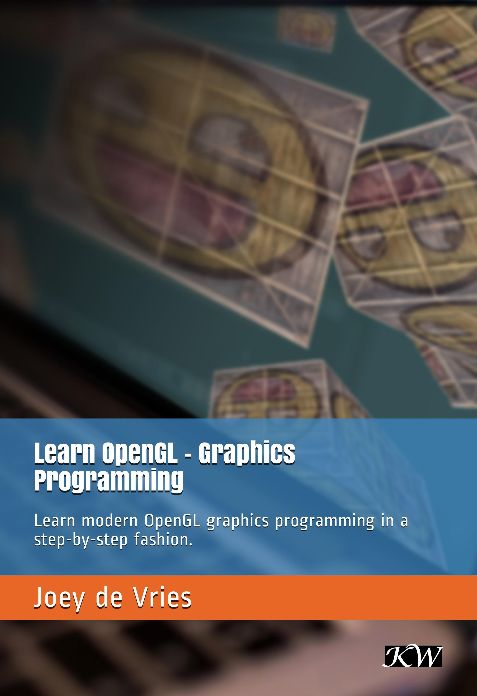

### فارسی👇

<strong>
<h2>پروژه‌های آموزشی "OpenGL"</h2>

این‌ها پروژه‌های کوچک آموزشی ساخته شده توسط خودم هستند تا بتوانم روند آموزشی خودم را در پوشه‌های متفاوت و کاملاً مرتبط و مرحله به مرحله به پیش بِبَرَم.
 
 
شما هم می‌توانید از این Git استفاده کنید و OpenGL را منظم یاد بگیرید.

<h1>کتاب پیشنهادی برای یادگیری "OpenGL":</h1>
این کتاب یکی از بهترین کتاب‌هاست برای یادگیری OpenGL با زبان برنامه نویسی ++C است.
<h3>(خداست این کتاب) 😎👇</h3>
<a href="https://learnopengl.com/book/book_pdf.pdf">دانلود کتاب</a>

</strong>

___
### English👇
## Educational projects "OpenGL":
**These are small educational projects made by myself so that I can carry out my own educational process in different and fully related folders step by step.**

**You can also use this Git and learn OpenGL regularly.**
# Recommended book for learning "OpenGL":
This book is one of the best books for learning OpenGL with C++ programming language.
(This book is GOD) 😎👇

[Download Book](https://learnopengl.com/book/book_pdf.pdf)

## تمام.
## Done.